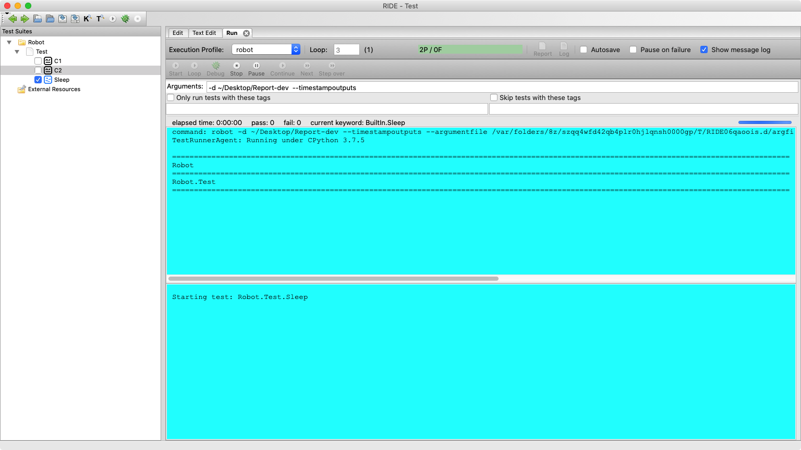

# RIDE-Rz

RIDE-Rz is a fork of [RIDE](https://github.com/robotframework/RIDE) which is a development environment for [Robot Framework](https://github.com/robotframework/robotframework) test cases.

# New Features
new features:
  - Loop your test cases.
  - Export project path as PYTHONPATH.
  - Fixed bugs in setting UI.

# Build and Install

```
python3 setup.py bdist_wheel

cd dist
pip install robotframework_ride-1.7.4.2.post<*>-py3-none-any.whl
```

# Demo



